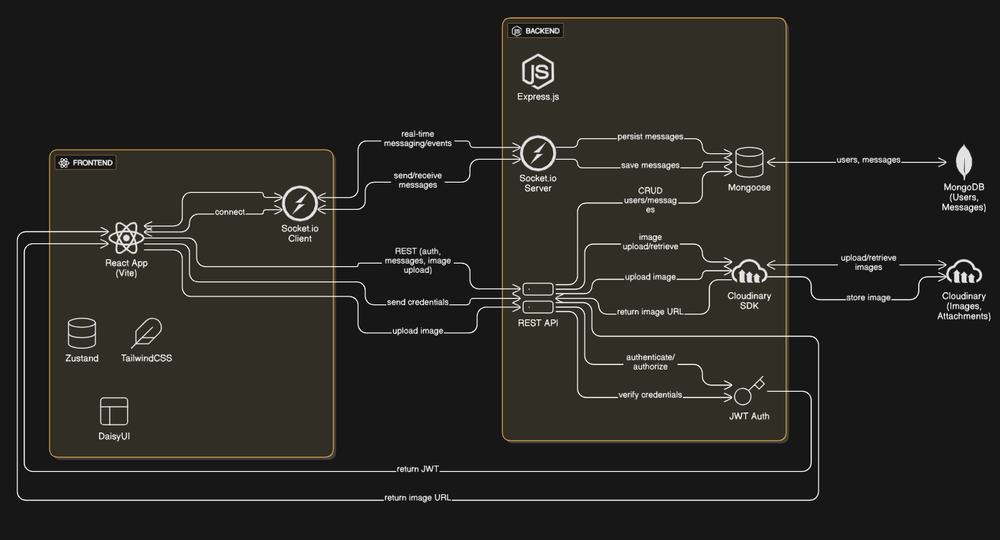

# ✨ Full Stack Realtime Chat App ✨

## Architecture Diagram



Highlights:

- 🌟 Tech stack: MERN + Socket.io + TailwindCSS + Daisy UI
- 🎃 Authentication && Authorization with JWT
- 👾 Real-time messaging with Socket.io
- 🚀 Online user status
- 👌 Global state management with Zustand
- 🐞 Error handling both on the server and on the client
- ⭐ At the end Deployment like a pro for FREE!
- ⏳ And much more!

---

## API Endpoints

### Auth Endpoints (`/api/auth`)

| Method | Endpoint          | Description                 | Body Params                     | Protected |
| ------ | ----------------- | --------------------------- | ------------------------------- | --------- |
| POST   | `/signup`         | Register a new user         | `fullName`, `email`, `password` | No        |
| POST   | `/login`          | Login user                  | `email`, `password`             | No        |
| POST   | `/logout`         | Logout user                 | None                            | No        |
| PUT    | `/update-profile` | Update profile picture      | `profilePic` (base64)           | Yes       |
| GET    | `/check`          | Check authentication status | None                            | Yes       |

### Message Endpoints (`/api/messages`)

| Method | Endpoint    | Description                         | Body Params              | Protected |
| ------ | ----------- | ----------------------------------- | ------------------------ | --------- |
| GET    | `/users`    | Get all users except logged-in user | None                     | Yes       |
| GET    | `/:id`      | Get messages with a user            | None                     | Yes       |
| POST   | `/send/:id` | Send message (text/image) to user   | `text`, `image` (base64) | Yes       |

---

## Other Details

- **Image Uploads:** Images are uploaded to Cloudinary via base64 strings.
- **Real-time Messaging:** Uses Socket.io for instant message delivery and online status.
- **JWT Auth:** All protected endpoints require a valid JWT cookie.

---

## Build the app

```shell
npm run build
```

## Start the app

```shell
npm start
```
